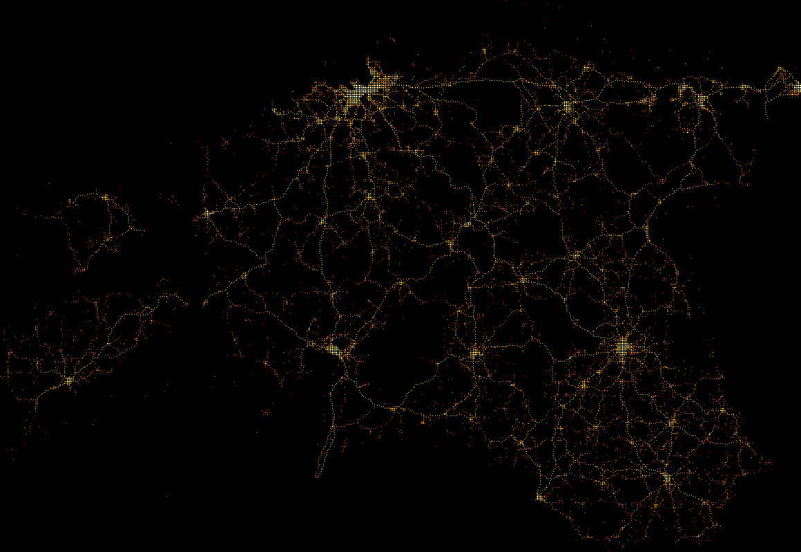
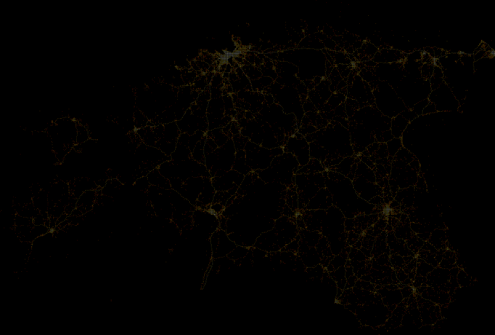

# Eesti Politsei avaandmete visualiseeringud

Kood: [first.ipynb](first.ipynb).

Kasutatud teek: [datashader](http://datashader.org).

### Avaliku korra vastased ja avalikus kohas toime pandud varavastased süüteod 

### Liiklusjärelevalve käigus avastatud süüteod

### Varavastased süüteod 

### Kõik koos

