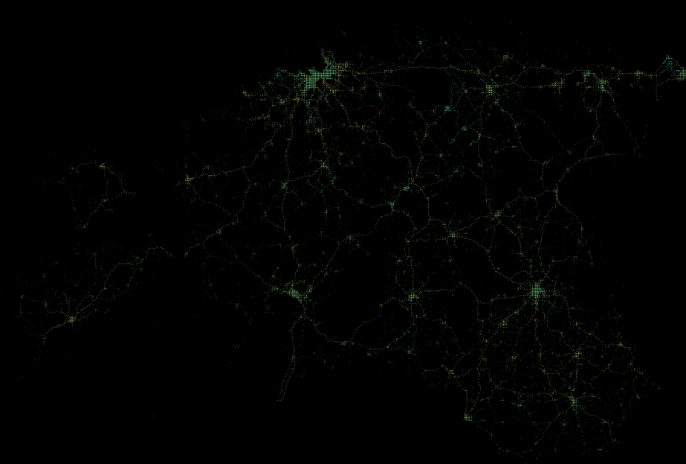

# Eesti Politsei avaandmete visualiseeringud

Kood: [first.ipynb](first.ipynb).

Kasutatud teek: [datashader](http://datashader.org).

### Avaliku korra vastased ja avalikus kohas toime pandud varavastased süüteod 

### Liiklusjärelevalve käigus avastatud süüteod

### Varavastased süüteod 

Avalik kord helesinine, vara kollane, liiklus punane. Kokku u 1 000 000 andmepunkti. (Avalik kord domineerib, kuna seal on enim andmeid.

